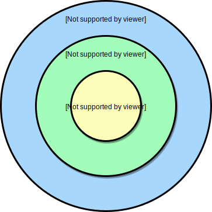
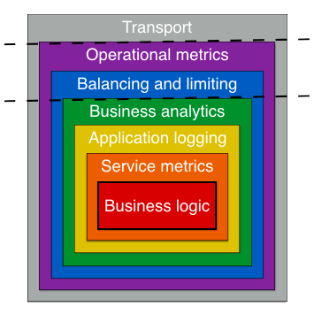

# Overview

## Goals

Optimize for maintainability above all else!

### Current Goals

- A standard library for microservices
- Adapters, bindings, etc. to common infrastructure components
- Play nice in your existing, heterogeneous infrastructure
- Structure to tame the beast of incidental complexity
- Less opinionated about the infrastructure
- More opinionated about application infrastructure

### Non-goals

- Messaging patterns other than RPC
- Requiring specific bits of infrastructure or tooling to work
- All-in service framework
- Re-implementing existing, good solutions to problems

## Architecture

- Keep your "Core Business Logic" away from:
  - Transport implementation
  - App Logging
  - Metrics
  - Tracing
  - Circuit Breaking
  - Rate Limiting
  - Audit Logging
  - Service Discovery
  - Deploy Strategy
  - Contract Testing
  - Alerting
  - Service Registry
  - Security
  - Caching Strategy
  - and [more...](https://medium.com/fme-developer-stories/sean-treadways-concerns-of-a-single-service-fc3753da1a2f)

### Onion Model/Architecture

- Similar to Clean Architecture by Robert Martin
  - **Dependency rule**: Source code dependencies can only point inwards

#### Layers

- **Service layer** (Inner most)

> Implements the core business logic by defining an interface for service and providing a concrete implementation

- **Endpoint layer** (Middle)

> Writes service middlewares to provide additional functionality like: logging, analytics, instrumentation, circuit breaking -- anything that needs knowledge of business domain

- **Transport layer** (Outer)

> Transport logic like: rate limiting, load balancing, distributed tracing -- all of which are agnostic to business domain
